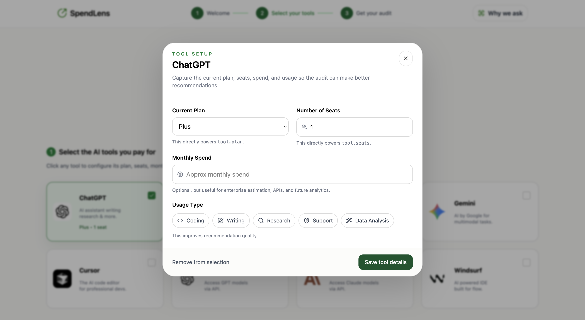
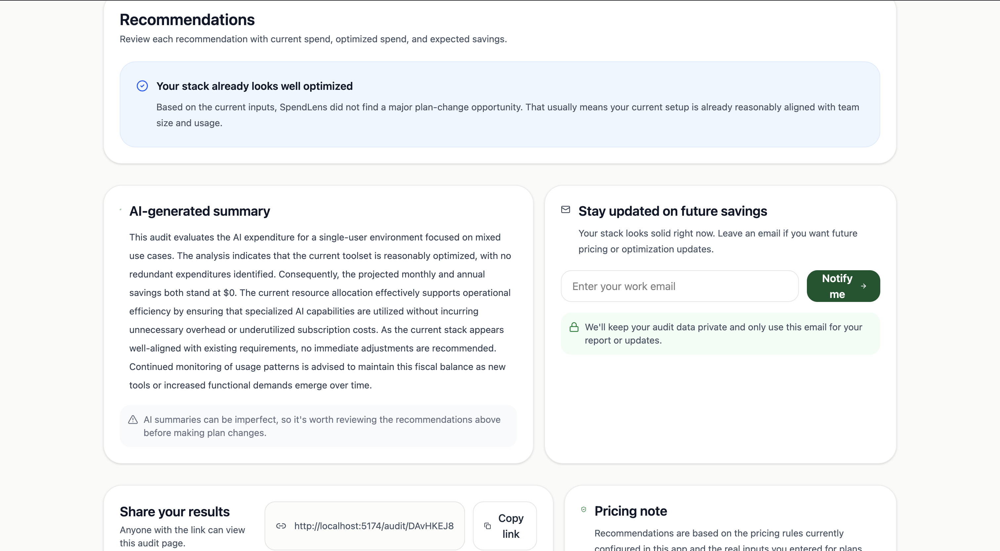

# SpendLens

SpendLens is a lightweight AI spend audit tool for startup founders and engineering leads who pay for multiple AI subscriptions but do not have a clear benchmark for whether their stack is efficient. A user picks the tools they use, enters plan, seat, and spend details, and gets an instant audit with savings estimates, per-tool recommendations, a generated summary, and a shareable result page.

## Demo assets

- Deployed URL: `https://spendlens-steel.vercel.app/`
- Demo Video:
    Youtube Video Link: `https://youtu.be/riyKn7tnjIU`
- Screenshot 1: 
    
- Screenshot 2: 
    
- Screenshot 3: 
    
- ScreenShot 4:
    
- ScreenShot 5:
    
## What is currently implemented

- Marketing landing page for the product
- Multi-tool audit form for ChatGPT, Claude, GitHub Copilot, Gemini, Cursor, OpenAI API, Anthropic API, and Windsurf
- Rule-based audit engine for plan downgrade and spend-gap recommendations
- AI-generated summary with a templated fallback path
- Firestore-backed shareable result route using a generated audit identifier in the URL
- Email send flow from the result page using EmailJS

## What is not complete yet

- Lead capture is not stored in a real backend yet
- Open Graph metadata per audit is not implemented yet
- Secrets and AI integrations still run client-side, which is acceptable for a prototype but not for production
- No automated test suite — tests are planned but not implemented

## Quick start

### Install

```bash
npm install
```

### Run locally

```bash
npm run dev
```

### Build for production

```bash
npm run build
```

### Deploy

This project is a Vite React SPA and can be deployed to Vercel, Netlify, Cloudflare Pages, or Render as a static frontend. Before deploying, move API keys and email credentials to environment variables and replace the temporary client-side integrations with a server-backed flow.

## Decisions

1. I used `React + Vite` because the assignment rewards shipping speed, iteration, and clean component-based UI more than framework ceremony. Vite kept setup minimal and made it easy to focus on the product flow.
2. I kept the audit math rule-based instead of LLM-generated because the assignment explicitly asks for defensible pricing logic. Deterministic rules are easier to inspect, test, and explain to a finance-literate reviewer.
3. I collected `per-tool plan, seats, spend, and usage tags` rather than asking for one big monthly AI budget. That makes the recommendations more actionable and supports per-tool breakdowns on the result page.
4. I generated the personalized summary separately from the pricing engine so the audit math remains deterministic even if the model fails. The UI can still show a useful result with the fallback summary.
5. I made the result page highly visual because it is the part most likely to get screenshotted, shared, or used as a sales conversation starter. The assignment is clear that this page matters as much as the calculation itself.

## Notes for final submission

- Add the real deployed URL and demo assets above
- Replace all hardcoded secrets with environment variables
- Move audit and lead persistence behind a server-backed flow
- Add tests and CI before calling the project submission-ready
