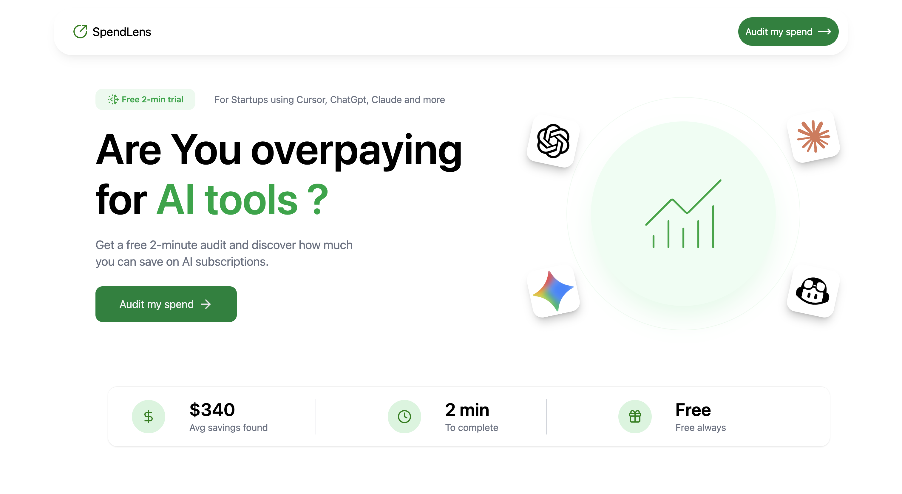
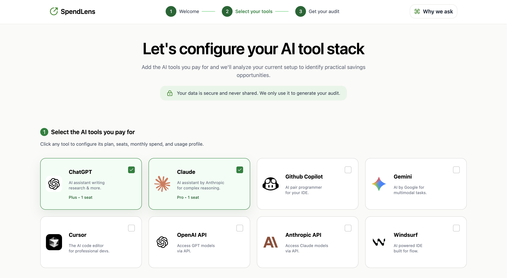
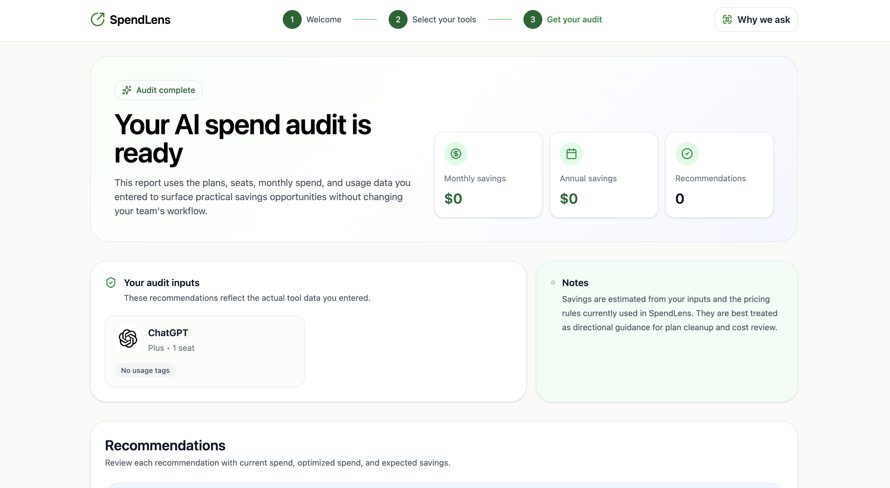

# SpendLens

SpendLens is an AI spend audit tool for startup founders and engineering leads who use multiple AI products but do not have a clear benchmark for whether their stack is cost-efficient. Users enter the AI tools they pay for, their plans, team size, and monthly spend, then receive an instant audit with savings opportunities, downgrade suggestions, and a personalized summary.

The project is designed as both a genuinely useful budgeting tool and a lead-generation product for AI infrastructure resellers like Credex.

---

## Live Demo

Deployed URL:  
https://spendlens-steel.vercel.app/

Demo Video:  
https://youtu.be/riyKn7tnjIU

---

## Screenshots

### Landing Page


### Audit Form


### Audit Results


---

## Features

### Implemented

- Marketing landing page
- Multi-tool AI spend audit form
- Support for:
  - ChatGPT
  - Claude
  - Cursor
  - GitHub Copilot
  - Gemini
  - OpenAI API
  - Anthropic API
  - Windsurf
- Rule-based audit engine with plan downgrade and spend optimization logic
- Personalized AI-generated audit summary with fallback handling
- Unique audit IDs and result routes
- Email capture flow using EmailJS
- Responsive UI optimized for desktop and mobile
- Local persistence for form state across refreshes
- Firestore-backed audit persistence and shared audit hydration
---

## Current limitations

- Audit persistence now works through Firestore-backed hydration, but the current implementation still needs stronger production validation, cleanup handling, and access controls
- Public share URLs currently depend on database hydration and still need stronger production validation
- Open Graph metadata per audit is not implemented yet
- API requests currently use client-side environment variables suitable for a prototype but not production
- Test coverage currently focuses only on the audit engine and is still limited relative to a production-grade system
 
---

## Tech Stack

- React
- Vite
- JavaScript
- Tailwind CSS
- Firebase Firestore
- Gemini API
- EmailJS

---

## Quick Start

### Install

```bash
npm install